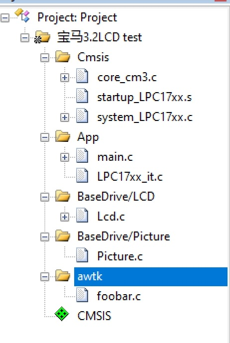
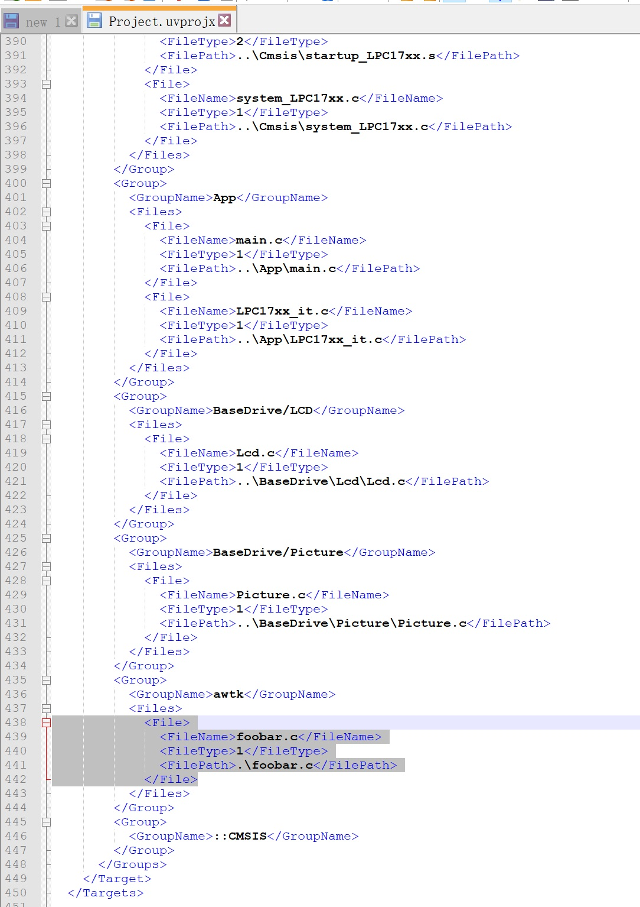
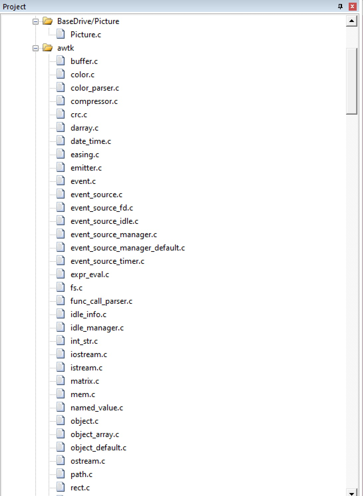
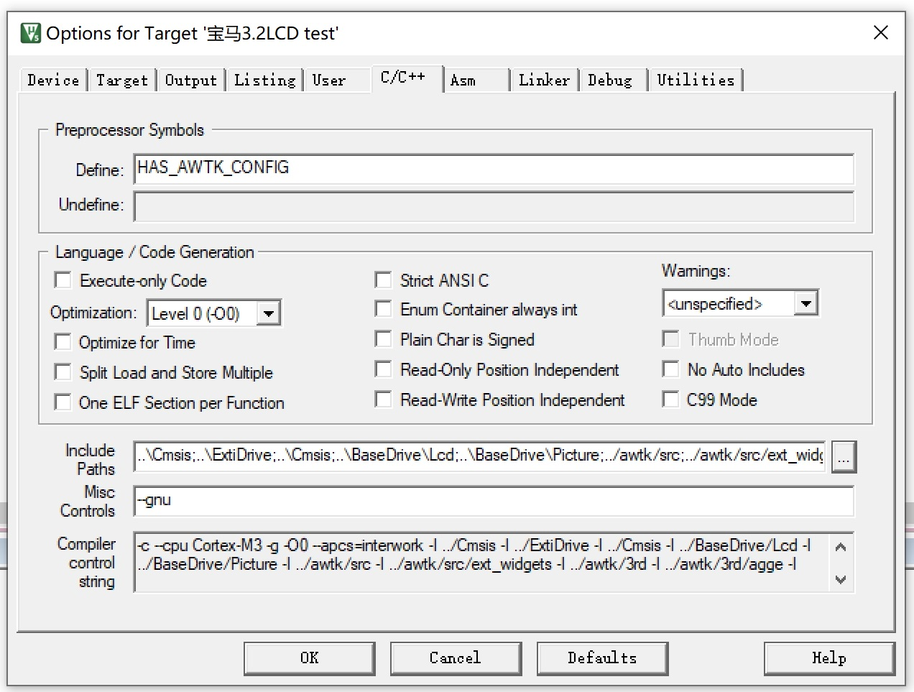
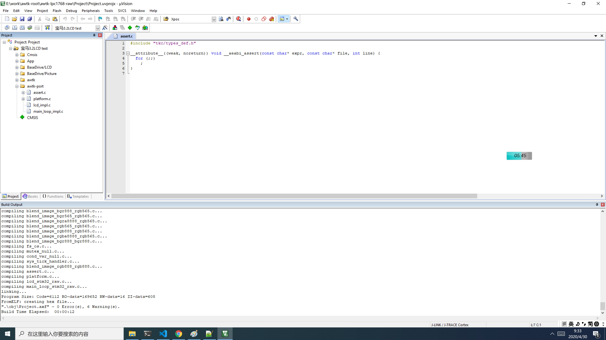
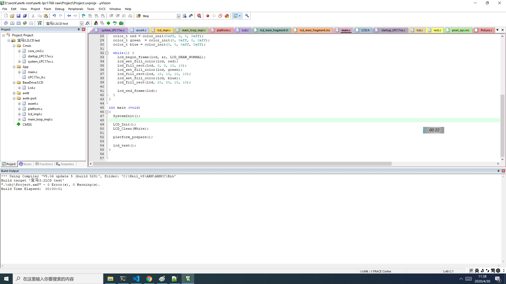
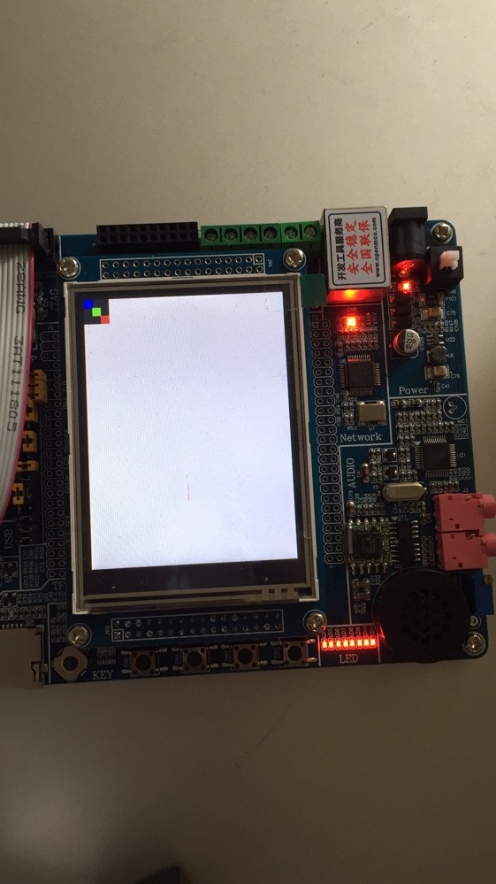

# NXP LPC1768 移植笔记

## 1. 介绍

[LPC1768](https://baike.baidu.com/item/LPC1768) 具有 512KB 的 flash 存储器、64KB 的数据存储器，这是 AWTK 能运行的最低配置。对于更低的配置，则需要做些定制裁剪，裁剪过程很复杂，需要专业人士来做，本文这里就不多说。

LPC1768 和 STM32F103 是一个等级的芯片，移植的方法基本一样，STM32F103 及同类芯片的移植均可参考本文。

本文以 [旺宝开发板宝马 NXP LPC1768+3.2 寸液晶屏 学习板单片机 ](https://item.taobao.com/item.htm?spm=a1z10.5-c-s.w4002-2057489827.21.383e6070DO0RFI&id=41360412223) 载体移植，其它板子其根据实际情况进行调整。

在移植的时候，不管是什么板子，拿到板子的资料后，先找一个带有显示功能的最简示例。以这个最简示例为模板，加入 AWTK 相关代码再进行移植。本文中使用开发板提供的显示图片的例子，具体位置在：

```
旺宝 LPC1768 开发板、3. 源代码-Example\2、TFT 屏例程、3.2 寸、【1】旺宝 1768_LCD 显示图片、【01】宝马 1768_LCD 显示 dada
```

> 这是一个 Keil 工程，在移植之前，先确保该工程能够正常编译、下载和运行。

## 2. 将 awtk 项目取到当前目录

* 从 github 上获取源码

```
git clone https://github.com/zlgopen/awtk.git
```

* 确保 awtk 是在当前目录中。

```
drwxr-xr-x 1 Admin 197121     0 4 月  29 21:53 App/
drwxr-xr-x 1 Admin 197121     0 4 月  30 07:00 awtk/
drwxr-xr-x 1 Admin 197121     0 4 月  30 07:01 awtk-port/
drwxr-xr-x 1 Admin 197121     0 4 月  29 21:53 BaseDrive/
```

## 3. 在当前目前创建 awtk-port 子目录

```
drwxr-xr-x 1 Admin 197121     0 4 月  29 21:53 App/
drwxr-xr-x 1 Admin 197121     0 4 月  30 07:00 awtk/
drwxr-xr-x 1 Admin 197121     0 4 月  30 07:01 awtk-port/
drwxr-xr-x 1 Admin 197121     0 4 月  29 21:53 BaseDrive/
```

## 4. 创建配置文件 awtk-port/awtk_config.h 

```
-rw-r--r-- 1 Admin 197121 3930 4 月  30 07:13 awtk-port/awtk_config.h
```

在创建配置文件时，以 awtk/src/base/awtk_config_sample.h 为蓝本，并参考类似平台的配置文件：

对于低端平台 (Cortex M3)，典型的配置如下：

```
/**
 * 嵌入式系统有自己的 main 函数时，请定义本宏。
 *
 */
 #define USE_GUI_MAIN 1

/**
 * 如果需要支持预先解码的位图字体，请定义本宏。一般只在 RAM 极小时，才启用本宏。
 */
#define WITH_BITMAP_FONT 1

/**
 * 如果定义本宏，使用标准的 UNICODE 换行算法，除非资源极为有限，请定义本宏。
 *
 */
#define WITH_UNICODE_BREAK 1

/**
 * 如果不需输入法，请定义本宏
 *
 */
#define WITH_NULL_IM 1

/**
 * 如果出现 wcsxxx 之类的函数没有定义时，请定义该宏
 *
 * #define WITH_WCSXXX 1
 */
#define WITH_WCSXXX 1

/**
 * 对于低端平台，如果不使用控件动画，请定义本宏。
 *
 */
 #define WITHOUT_WIDGET_ANIMATORS 1

/**
 * 对于低端平台，如果不使用窗口动画，请定义本宏。
 *
 */
 #define WITHOUT_WINDOW_ANIMATORS 1

/**
 * 对于低端平台，如果不使用对话框高亮策略，请定义本宏。
 *
 */
 #define WITHOUT_DIALOG_HIGHLIGHTER 1

/**
 * 对于低端平台，如果不使用扩展控件，请定义本宏。
 *
 */
 #define WITHOUT_EXT_WIDGETS 1

/**
 * 对于低端平台，如果内存不足以提供完整的 FrameBuffer，请定义本宏启用局部 FrameBuffer，可大幅度提高渲染性能。
 *
 */
#define FRAGMENT_FRAME_BUFFER_SIZE 8 * 1024
```

## 5. 加入 AWTK 的源文件

AWTK 的源文件很多，而且不同的平台，加入的文件有所不同，导致加文件的过程非常痛苦。为此，我把 cortex m3 需要的文件，放到 files/files_m3.txt 文件中，并本生成 keil 需要的 xml 格式，放到 files/files_m3.xml 中。自己创建项目时，把 files/files_m3.xml 中的内容放到 Project/Project.uvprojx 即可。

如果不知道放到 Project/Project.uvprojx 中哪个位置，可以先在 keil 中创建一个 Group，名为 awtk，并添加一个 foobar.c 的文件：

> 在 foobar.c 中随便写点内容，如注释之类的东西。



保存并关闭项目，用 notepad++等编辑器打开 Project/Project.uvprojx，找到 foobar.c 的位置：



用 files/files_m3.xml 中的内容替换选中部分的内容，保存文件并退出。

> 如果 Project.uvprojx 文件不是在 Project（或其它名字）子目录下，而是项目根目录下（和 awtk 并列），则需要编辑 files/files_m3.xml，把。.\awtk 替换成。\awtk。

用 keil 重新打开工程文件 Project.uvprojx，我们可以看到文件已经加入：



## 6. 配置 keil 工程

* 定义宏 HAS\_AWTK\_CONFIG

* 增加头文件路径

```
../awtk/src;../awtk/src/ext_widgets;../awtk/3rd;../awtk/3rd/agge;../awtk/3rd/nanovg;../awtk/3rd/nanovg/base;../awtk/3rd/gpinyin/include../awtk/3rd/libunibreak;../awtk-port;
```
* Misc Controls 中加上--gnu 标志。

设置界面的效果如下：



## 7. 加入硬件平台相关的文件

编译一下，可以发现，编译没有问题，但是链接时有几个函数找不到。

```
linking...
.\obj\Project.axf: Error: L6218E: Undefined symbol lcd_mem_fragment_get_buff (referred from widget.o).
.\obj\Project.axf: Error: L6218E: Undefined symbol main_loop_init (referred from awtk_global.o).
.\obj\Project.axf: Error: L6218E: Undefined symbol platform_prepare (referred from awtk_global.o).
Not enough information to list image symbols.
Not enough information to list load addresses in the image map.
Finished: 2 information, 0 warning and 3 error messages.
".\obj\Project.axf" - 3 Error(s), 0 Warning(s).
Target not created.
Build Time Elapsed:  00:00:01
```

现在我们在 awtk-port 目录中，加入以下几个文件。

后面写的硬件平台相关的代码，都会放到下面的文件中。这里先把框架写好，后面再来完善：

```
assert.c  awtk_config.h  lcd_impl.c  main_loop_impl.c  platform.c
```

### 1. assert.c 

开始移植的时，经常出现 assert，缺省 assert 的实现，触发 assert 时不知道 assert 的位置。为此我们可以自己实现一个 assert 函数，以方便调试时定位：

```c
#include "tkc/types_def.h"

__attribute__((weak, noreturn)) void __aeabi_assert(const char* expr, const char* file, int line) {
  for (;;)
    ;
}
```

### 2. lcd_impl.c

lcd_impl.c 用于实现 lcd 接口，m3 内存都比较小，通常使用 fragment buffer，我们先把框架实现好，后面根据平台实际情况进行完善：

```c
#include "tkc/mem.h"
#include "lcd/lcd_mem_fragment.h"

typedef uint16_t pixel_t;

#define LCD_FORMAT BITMAP_FMT_BGR565
#define pixel_from_rgb(r, g, b)                                                \
  ((((r) >> 3) << 11) | (((g) >> 2) << 5) | ((b) >> 3))
#define pixel_to_rgba(p)                                                       \
  { (0xff & ((p >> 11) << 3)), (0xff & ((p >> 5) << 2)), (0xff & (p << 3)) }

static inline void set_window_func(int start_x, int start_y, int end_x, int end_y) {
  /*TODO*/
}

static inline void write_data_func(uint16_t color) {
  /*TODO*/
}

#include "base/pixel.h"
#include "blend/pixel_ops.inc"
#include "lcd/lcd_mem_fragment.inc"
```

### 3. main_loop_impl.c

main_loop_impl.c 主要负责各种事件的分发，这里使用 main_loop_raw.inc 来实现具体功能，提供 dispatch_input_events 函数用于读取和分发触屏和按键事件即可。

```c
#include "base/idle.h"
#include "base/timer.h"
#include "tkc/platform.h"
#include "base/main_loop.h"
#include "base/event_queue.h"
#include "base/font_manager.h"
#include "lcd/lcd_mem_fragment.h"
#include "main_loop/main_loop_simple.h"

ret_t platform_disaptch_input(main_loop_t *l) { return RET_OK; }

static lcd_t *platform_create_lcd(wh_t w, wh_t h) {
  return lcd_mem_fragment_create(w, h);
}

void dispatch_input_events(void) {
  /*TODO*/
}

#include "main_loop/main_loop_raw.inc"
```

### 4. platform.c

主要负责 heap 内存的初始化，请根据平台实际情况调整 s\_heam\_mem 的大小。

在裸系统的平台中，内存主要分为几种用途：

* 栈
* 堆
* 驱动
* 全局变量。
* fragment framebuffer

> 请根据具体情况进行分配和调整。

```c
#include "tkc/mem.h"
#include "base/timer.h"

ret_t platform_prepare(void) {
  static bool_t inited = FALSE;
  static uint32_t s_heam_mem[6000];

  if (!inited) {
    inited = TRUE;
    tk_mem_init(s_heam_mem, sizeof(s_heam_mem));
  }

  return RET_OK;
}

```

### 5. 将以上文件加入到 keil 工程：



再编译一下，发现编译成功了。当然，只是编译成功而已，并不能真正运行起来，具体移植工作，还有没开始呢。

## 8. 编写平台相关的代码

### 8.1 实现 lcd

使用 fragment framebuffer 的 lcd 时，主要是需要提供几个宏，用于辅助实现 lcd\_mem\_fragment\_flush 函数。先看看 lcd\_mem\_fragment\_flush 函数的代码：

```c
static ret_t lcd_mem_fragment_flush(lcd_t* lcd) {
  lcd_mem_fragment_t* mem = (lcd_mem_fragment_t*)lcd;

  int32_t x = mem->x;
  int32_t y = mem->y;
  uint32_t w = mem->fb.w;
  uint32_t h = mem->fb.h;
  pixel_t* p = mem->buff;
  
#ifdef lcd_draw_bitmap_impl
  lcd_draw_bitmap_impl(x, y, w, h, p);
#else
  uint32_t nr = w * h;
  set_window_func(x, y, x + w - 1, y + h - 1);
  while (nr-- > 0) {
    write_data_func(*p++);
  }
#endif
	
  return RET_OK;
}
```

从以上代码可以看出，有两种方式：

* 提供 lcd\_draw\_bitmap\_impl 宏。

* 提供 set\_window\_func 和 write\_data\_func。

怎么实现，可以参考一下平台 SDK 提供贴图函数。比如在旺宝提供的 SDK 中，贴图函数是这样写的：

```c
void LCD_Bmp (unsigned int x, unsigned int y, unsigned int w, unsigned int h, unsigned char *bmp) 
{
  unsigned int    i, j;
  unsigned short *bitmap_ptr = (unsigned short *)bmp;

  LCD_WindowMax(x,y,x+w,y+h);
  LCD_SetCursor(x,y);
  wr_cmd(0x22);
  
 bitmap_ptr += (h*w)-1;
  for (j = 0; j < h; j++) {
    for (i = 0; i < w; i++) {
      wr_dat_only(*bitmap_ptr--);
	
    }
  }
}
```

这个函数和我们需要的 lcd\_draw\_bitmap\_impl 宏基本一致，可以直接拿来用。lcd\_impl.c 的内容如下：

```c

#include "LCD.h"
#include "tkc/mem.h"
#include "lcd/lcd_mem_fragment.h"

typedef uint16_t pixel_t;

#define LCD_FORMAT BITMAP_FMT_BGR565
#define pixel_from_rgb(r, g, b)                                                \
  ((((r) >> 3) << 11) | (((g) >> 2) << 5) | ((b) >> 3))
#define pixel_to_rgba(p)                                                       \
  { (0xff & ((p >> 11) << 3)), (0xff & ((p >> 5) << 2)), (0xff & (p << 3)) }

#define lcd_draw_bitmap_impl(x, y, w, h, p) LCD_Bmp(x, y, w, h, (unsigned char*)p)
		
#include "base/pixel.h"
#include "blend/pixel_ops.inc"
#include "lcd/lcd_mem_fragment.inc"

```

删除不必要的文件（如 Picture)，腾出空间供 AWTK 使用。为了确保 lcd 移植代码正确，特别是颜色格式是正确的，我们写个小测序，验证一下红绿蓝三色显示正常：

```c
void lcd_test(void) {
	rect_t r = rect_init(0, 0, 30, 30);
	lcd_t* lcd = lcd_mem_fragment_create(LCD_W, LCD_H);
	color_t red = color_init(0xff, 0, 0, 0xff);
	color_t green  = color_init(0, 0xff, 0, 0xff);
	color_t blue = color_init(0, 0, 0xff, 0xff);
	
	while(1) {
		lcd_begin_frame(lcd, &r, LCD_DRAW_NORMAL);
		lcd_set_fill_color(lcd, red);
		lcd_fill_rect(lcd, 0, 0, 10, 10);
		lcd_set_fill_color(lcd, green);
		lcd_fill_rect(lcd, 10, 10, 10, 10);
		lcd_set_fill_color(lcd, blue);
		lcd_fill_rect(lcd, 20, 20, 10, 10);
		
		lcd_end_frame(lcd);
	}
}

int main (void)                        
{
  SystemInit();

  LCD_Init();
  LCD_Clear(White);
	
	platform_prepare();
	
	lcd_test();
}
```

编译：



下载运行。如果开发板上出现以下界面，表示 lcd 正常工作了：



如果颜色不正常，通常是 r 和 g 通道反了，请根据具体情况定义下面的宏：

```c
#define LCD_FORMAT 
#define pixel_from_rgb(r, g,b)
#define pixel_to_rgba(p) 
```
